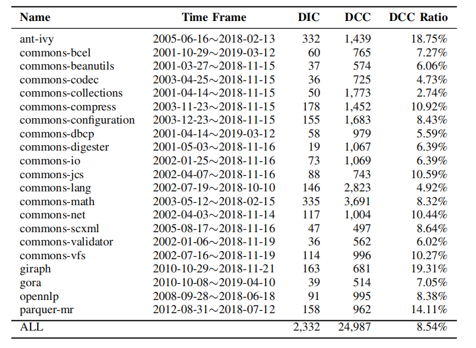

# Multi-objective-Just-in-time-Software-Defect-Prediction

Boosting Multi-objective Just-in-time Software Defect Prediction by Fusing Expert Metrics and Semantic Metrics

Dataset
========
This study used 21 Java projects from the large-scale high-quality data set recently collected by Ni et al. to mitigate the impact of tangled commits on the basis of LLTC4J.The details of statistical information  can be found in Table as bellow.

Result
=============

Operation Guide
===================
Train the MOJ-SDP model based on expert metrics： 
_________
    Use only the first 14 columns in the dataset.Change the size of matrix A in ..\MODEP\fitnessLogistic_nclasses.m and ..\Project\muti_testLogistic_nclasses.m,and change the variable 'nvar' in ..\MODEP\MODEP.m to 11.
Train the MOJ-SDP model based on semantic metrics： 
__________
    Use only the last 769 columns in the dataset.Change the size of matrix A in ..\MODEP\fitnessLogistic_nclasses.m and ..\Project\muti_testLogistic_nclasses.m,and change the variable 'nvar' in ..\MODEP\MODEP.m to 769.

Model complementary analysis, run 
____________
    venn\demo1.m
Model performance evaluation, run 
____________
    Bar_chart.m
    
